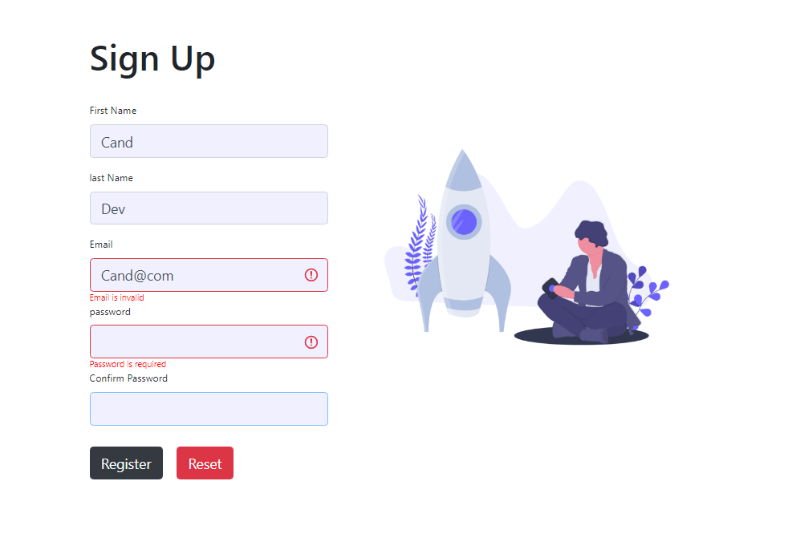

# Signup form with formik
Create simple signup form with formik and use yup for the validation

## screenshot


## Links
Formik : https://formik.org <br/>

### Video Tutorial
You can see my youtube video for this project in [here](https://youtu.be/u-CCnDayNJw)


## Available Scripts

In the project directory, you can run:

### `yarn start`

Runs the app in the development mode.\
Open [http://localhost:3000](http://localhost:3000) to view it in the browser.

The page will reload if you make edits.\
You will also see any lint errors in the console.

------------------------
-----------------------
----------------------
### main form summary 
TextField.js
```jsx

import React from 'react';
import { ErrorMessage, useField } from 'formik';

export const TextField = ({ label, ...props }) => {
  const [field, meta] = useField(props);
  return (
    <div className="mb-2">
      <label htmlFor={field.name}>{label}</label>
      <input
        className={`form-control shadow-none ${meta.touched && meta.error && 'is-invalid'}`}
        {...field} {...props}
        autoComplete="off"
      />
      <ErrorMessage component="div" name={field.name} className="error" />
    </div>
  )
}
```

Signup.js
```jsx
import React from 'react';
import { Formik, Form } from 'formik';
import { TextField } from './TextField';
import * as Yup from 'yup';

export const Signup = () => {
  const validate = Yup.object({
    firstName: Yup.string()
      .max(15, 'Must be 15 characters or less')
      .required('Required'),
    lastName: Yup.string()
      .max(20, 'Must be 20 characters or less')
      .required('Required'),
    email: Yup.string()
      .email('Email is invalid')
      .required('Email is required'),
    password: Yup.string()
      .min(6, 'Password must be at least 6 charaters')
      .required('Password is required'),
    confirmPassword: Yup.string()
      .oneOf([Yup.ref('password'), null], 'Password must match')
      .required('Confirm password is required'),
  })
  return (
    <Formik
      initialValues={{
        firstName: '',
        lastName: '',
        email: '',
        password: '',
        confirmPassword: ''
      }}
      validationSchema={validate}
      onSubmit={values => {
        console.log(values)
      }}
    >
      {formik => (
        <div>
          <h1 className="my-4 font-weight-bold .display-4">Sign Up</h1>
          <Form>
            <TextField label="First Name" name="firstName" type="text" />
            <TextField label="last Name" name="lastName" type="text" />
            <TextField label="Email" name="email" type="email" />
            <TextField label="password" name="password" type="password" />
            <TextField label="Confirm Password" name="confirmPassword" type="password" />
            <button className="btn btn-dark mt-3" type="submit">Register</button>
            <button className="btn btn-danger mt-3 ml-3" type="reset">Reset</button>
          </Form>
        </div>
      )}
    </Formik>
  )
}
```
